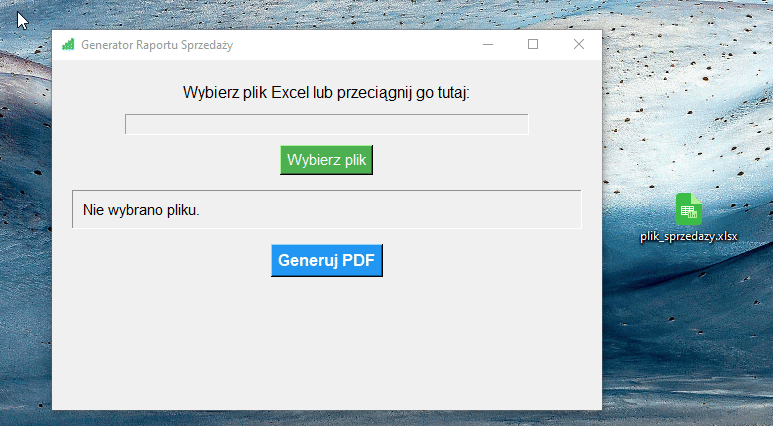
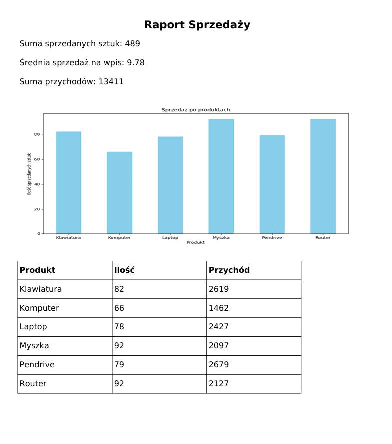
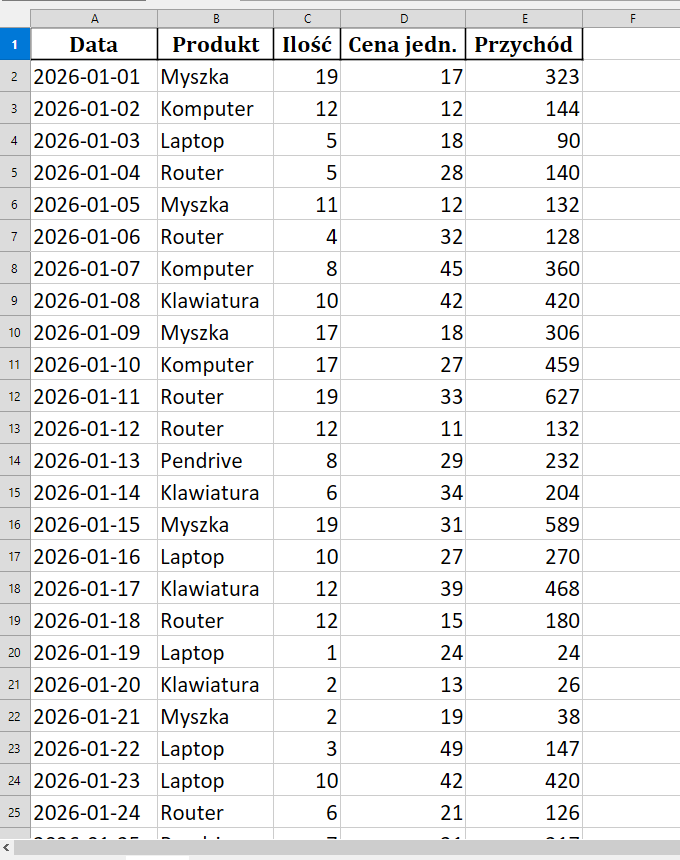

Generator Raportu Sprzedaży 📊🖨️

Aplikacja w Pythonie do automatyzacji procesu tworzenia raportów sprzedaży w formacie Excel → PDF z możliwością wysyłki mailowej.
Umożliwia szybkie podsumowanie danych sprzedażowych, generowanie wykresów, tabel i przesłanie raportu automatycznie.

Funkcjonalności

Wczytywanie danych sprzedażowych z pliku Excel (.xlsx / .xls)

Wyświetlanie podstawowych statystyk:

Liczba wierszy w danych

Liczba unikalnych produktów

Suma sprzedanych sztuk

Suma przychodów

Generowanie PDF z podsumowaniem i wykresem sprzedaży

Automatyczne tworzenie wykresu sprzedaży po produktach (bar chart)

Dodawanie tabeli sprzedaży do PDF

Możliwość wysyłki raportu mailem przez Gmail API

Drag & Drop plików Excel do aplikacji GUI

Zrzuty ekranu

- GUI aplikacji:

- Przykładowy PDF:

- Wykres sprzedaży:

Technologie

Python 3.14+

GUI: Tkinter + TkinterDnD2 (Drag & Drop)

Manipulacja danymi: pandas

Tworzenie PDF: fpdf

Tworzenie wykresów: matplotlib

Wysyłka maili: Gmail API (google-auth, google-api-python-client)

JSON: konfiguracja i przechowywanie sekretów (client_secret.json, config.json)

Struktura projektu
project/
├── src/
│ └── raport_generator.py # logika PDF, Excel, wysyłka mail
├── gui/
│ └── dashboard.py # interfejs graficzny
├── config/
│ └── config.json # konfiguracja konta e-mail
├── secret/
│ ├── client_secret.json # klucze Gmail API (NIE WCHODZI DO GIT)
│ └── token.json # token autoryzacji Gmail
├── font/
│ ├── DejaVuSans.ttf
│ └── DejaVuSans-Bold.ttf
├── README.md
└── requirements.txt # wszystkie paczki Python

Instrukcja użycia

Instalacja zależności:

pip install -r requirements.txt

Konfiguracja Gmail API:

Umieść swój client_secret.json w folderze secret/

Utwórz config.json w folderze config/ z adresem nadawcy:

{
"sender_email": "twoj.email@gmail.com"
}

Uruchom GUI:

python gui/dashboard.py

Wybór pliku Excel:

Kliknij „Wybierz plik” lub przeciągnij plik Excel do okna

Sprawdź podstawowe statystyki w panelu informacyjnym

Generowanie PDF:

Kliknij „Generuj PDF” → raport zostanie wygenerowany i wysłany mailem

Wymagania

Python >= 3.10

Biblioteki Python:

pandas
matplotlib
fpdf2
yagmail
google-auth
google-auth-oauthlib
google-api-python-client
tkinterdnd2
openpyxl
