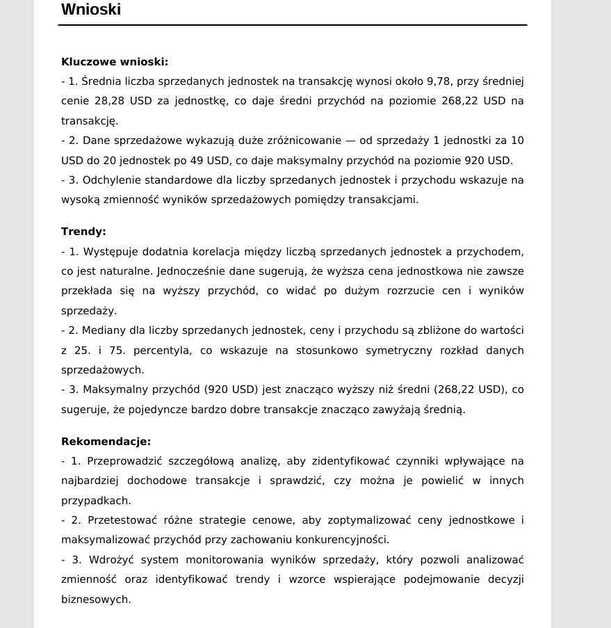

# 📊 Generator Raportu Sprzedaży

Aplikacja w Pythonie do automatyzacji procesu tworzenia raportów sprzedaży w formacie Excel → PDF z możliwością wysyłki mailowej.
Umożliwia szybkie podsumowanie danych sprzedażowych, generowanie wykresów, tabel i przesłanie raportu automatycznie oraz automatyczne generowanie wnioskow sprzedażowych.
=======
A Python-based automation tool that transforms Excel sales data into a professional PDF report, enriches it with charts and insights, and uploads it to AWS S3 with secure access via a presigned URL. The application includes a graphical user interface with drag & drop support and an interactive link popup for easy report access.
---

## 🚀 Features

### 📥 Data Processing

- Load sales data from Excel (`.xlsx / .xls`)
- Automatic calculation of:
  - Total number of rows
  - Number of unique products
  - Total units sold
  - Total revenue

---

### 📊 Report Generation

- PDF report generation using `FPDF`
- Automatic bar chart visualization (`matplotlib`)
- Product-level sales table
- AI-ready section for business insights (optional integration)

---

### ☁️ AWS Cloud Integration

- Upload generated PDF to **Amazon S3**
- Secure file access using **Presigned URLs**
- No need for public bucket exposure
- Temporary secure download links (expiry-based access)

---
- Automatycznie generowane wnioski przez sztuczną inteligencję

Zrzuty ekranu
=======
### 🖥️ GUI Application

- Built with `Tkinter + TkinterDnD2`
- Drag & Drop Excel file support
- Real-time data summary dashboard
- Interactive popup with:
  - 📋 Copy link
  - 🌐 Open in browser
  - ❌ Close window

---

### 📧 Email Integration (Optional)

- Gmail API support for automatic report delivery
- OAuth 2.0 authentication (secure token-based login)

---

## 🧠 Workflow


-Wnioski AI:



Technologie
=======
Excel File → Data Analysis → PDF Report → AWS S3 Upload → Presigned URL → GUI Popup Link

---

## 🖼️ Screenshots

### 🖥️ GUI Application


### 📄 Generated PDF Report


### 📊 Sales Chart


### ☁️ AWS S3 Link Popup (NEW)


- pandas (data processing)
- matplotlib (data visualization)
- fpdf2 (PDF generation)
- boto3 (AWS S3 integration)
- openpyxl (Excel handling)
- Google Gmail API (optional email automation)

---

## 📁 Project Structure
```
project/ ├── src/ │   └── raport\_generator.py        # PDF generation + AWS upload ├── gui/ │   └── dashboard.py               # Tkinter GUI ├── config/ │   └── config.json                # AWS + app configuration ├── secret/ │   ├── client\_secret.json         # Gmail API credentials (ignored in Git) │   └── token.json                 # OAuth token ├── font/ │   ├── DejaVuSans.ttf │   └── DejaVuSans-Bold.ttf ├── screenshots/ │   ├── gui.png │   ├── pdf\_report.png │   ├── chart.png │   └── s3\_popup.png ├── README.md └── requirements.txt
```
---

## ⚙️ Installation

```bash
pip install -r requirements.txt
```

---

## 🔐 Configuration

### config/config.json

```json
{
  "sender_email": "your_email@gmail.com",
  "bucket_name": "your-s3-bucket",
  "access_key": "AWS_ACCESS_KEY",
  "secret_key": "AWS_SECRET_KEY",
  "file_name_pdf": "raport_sprzedazy.pdf",
  "pdf_path": "../raport_sprzedazy.pdf"
}
```

---

## ▶️ How to Run

### Start GUI

```bash
python gui/dashboard.py
```

---

## 📌 Usage Flow

1. Select or drag & drop Excel file
2. View automatic sales summary
3. Click **Generate PDF**
4. Report is created and uploaded to AWS S3
5. Popup appears with options:
   - Open report in browser 🌐
   - Copy link 📋
   - Close ❌

---

## 🔥 Key Highlights (for recruiters)

- End-to-end automation pipeline (Excel → Cloud → PDF)
- AWS S3 integration with secure presigned URLs
- Interactive desktop GUI (Tkinter)
- Real-world data processing workflow
- Production-style project structure
- Clean separation of backend, UI, and cloud logic

---

## 📈 Future Improvements

- Deploy as web app (FastAPI / Streamlit)
- Add database storage (PostgreSQL)
- Docker containerization
- CI/CD pipeline (GitHub Actions)
- Advanced AI-generated insights (OpenAI integration)

---

## 🏆 Author

Python Automation & Cloud Project\
Focused on Data Engineering, RPA and Cloud Integration

